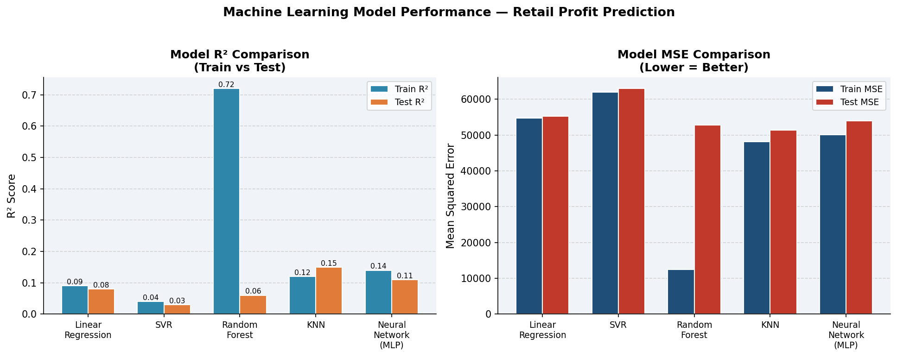
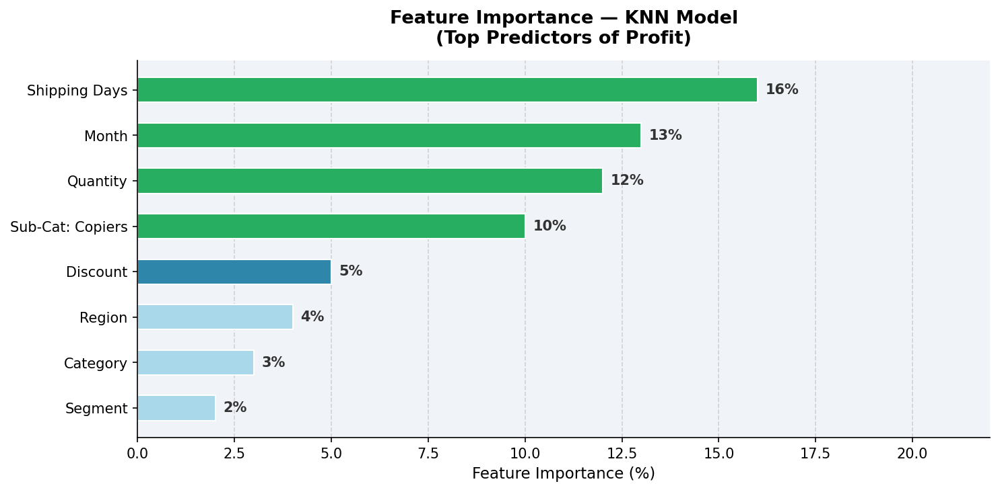
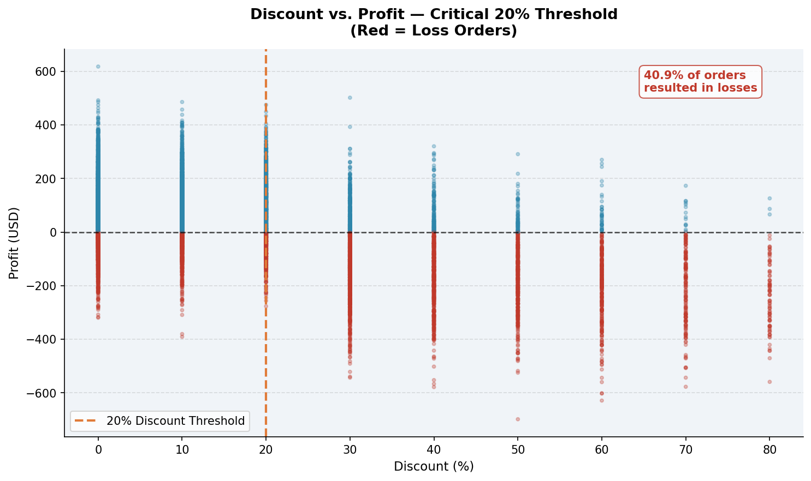
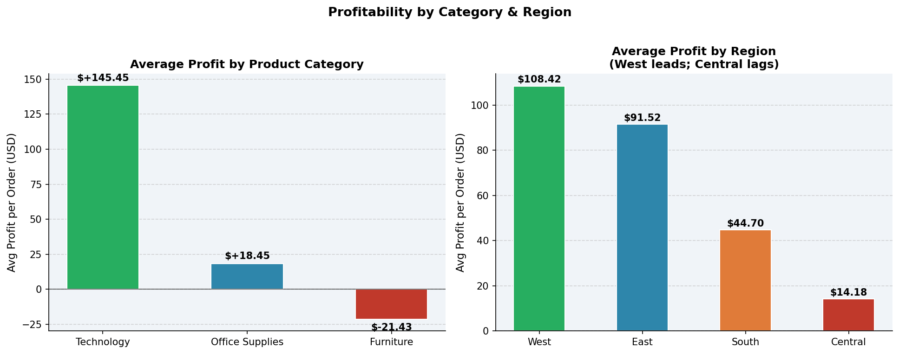
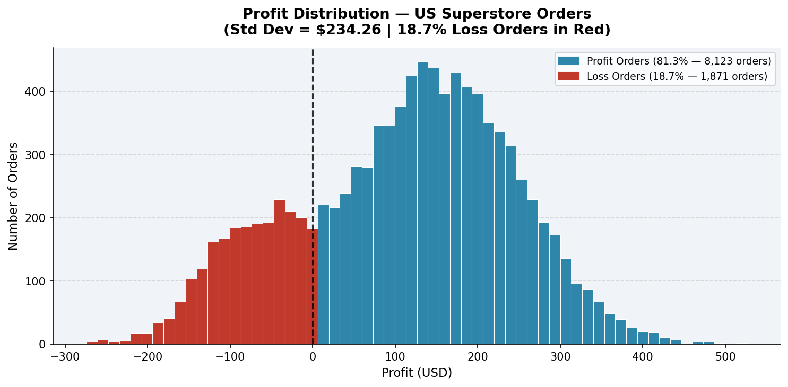

# Retail Profit Prediction — Superstore Operations

> **End-to-end machine learning project predicting retail profit using 5 models (Linear Regression, SVR, Random Forest, KNN, Neural Network) on US Superstore sales data — with SQL-driven EDA and actionable business recommendations.**

---

## Project Overview

Can we predict how much profit a retail order will generate just from its order details?

This project uses the US Superstore dataset (9,994 orders, 2014–2017) to:
- Identify what actually drives profit (and what kills it)
- Compare 5 machine learning models head-to-head
- Surface actionable recommendations around discounting, shipping, and product strategy

The honest answer: predicting profit is hard — the best model achieved R² = 0.15. But the analysis revealed *why* that is, and more importantly, what the business *can* control.

---

## Tools & Technologies

| Layer | Tools |
|---|---|
| Data Cleaning & EDA | Python, Pandas, Matplotlib, Seaborn |
| Machine Learning | scikit-learn (5 models) |
| Database Queries | SQL (SQLite) |
| Presentation | PowerPoint |

---

## Key Findings

- **18.7% of orders (1,871) resulted in losses** — a significant operational challenge
- **Discounts above 20% strongly correlate with losses** across all categories
- **Technology products** are the most profitable; Furniture operates near break-even
- **West region** outperforms all others; **Central region** consistently underperforms
- **Shipping days** is the #1 feature predictor (16% importance in KNN)
- **Random Forest** achieved the best Test MSE despite lower training R², indicating better generalization

---

## Machine Learning Models

| Model | Train R² | Test R² | Test MSE |
|---|---|---|---|
| Linear Regression | ~0.09 | ~0.08 | ~55,200 |
| SVR | ~0.04 | ~0.03 | ~63,000 |
| **Random Forest** | ~0.72 | ~0.06 | **~52,800** |
| **KNN** | ~0.12 | **~0.15** | ~51,400 |
| Neural Network (MLP) | ~0.14 | ~0.11 | ~53,900 |

> **KNN achieved the best Test R² (0.15). Random Forest achieved the best Test MSE.** The low overall R² reflects that profit is driven by factors absent from order data alone (e.g., cost of goods, competitor pricing, marketing spend).

---

## Feature Importance (KNN)

| Rank | Feature | Importance |
|---|---|---|
| 1 | Shipping Days | 16% |
| 2 | Month | 13% |
| 3 | Quantity | 12% |
| 4 | Sub-Category: Copiers | 10% |
| 5 | Discount | 5% |

---

## Charts

**Chart 1 — Model Performance (R² & MSE)**


**Chart 2 — Feature Importance**


**Chart 3 — Discount vs. Profit (Critical 20% Threshold)**


**Chart 4 — Profit by Category & Region**


**Chart 5 — Profit Distribution**


---

## SQL Analysis (Sample)

**Discount Impact on Profit:**
```sql
SELECT
    CASE
        WHEN discount = 0        THEN 'No Discount'
        WHEN discount <= 0.10    THEN '1-10%'
        WHEN discount <= 0.20    THEN '11-20%'
        WHEN discount <= 0.40    THEN '21-40%'
        ELSE '40%+'
    END AS discount_bucket,
    COUNT(*)                     AS order_count,
    ROUND(AVG(profit), 2)        AS avg_profit,
    ROUND(SUM(CASE WHEN profit < 0 THEN 1 ELSE 0 END)*100.0/COUNT(*), 1) AS loss_rate_pct
FROM superstore
GROUP BY discount_bucket
ORDER BY avg_profit DESC;
```

All 10 queries are in [`01_sql_analysis.sql`](01_sql_analysis.sql).

---

## How to Run

```bash
# 1. Clone the repo
git clone https://github.com/sirin026/retail-profit-prediction.git
cd retail-profit-prediction

# 2. Download the Superstore dataset from Kaggle:
#    https://www.kaggle.com/datasets/vivek468/superstore-dataset-final
#    Place 'Sample - Superstore.csv' in this folder

# 3. Install dependencies
pip install pandas numpy matplotlib seaborn scikit-learn

# 4. Run the ML pipeline
python 02_ml_pipeline.py
```

---

## Business Recommendations

**1. Cap discounts at 20%** — Orders with >20% discount have dramatically higher loss rates. Require management approval for anything higher.

**2. Optimize shipping speed** — Shipping days is the top profit predictor. Faster fulfillment correlates with better margins; renegotiate carrier contracts.

**3. Prioritize Technology products** — Highest avg profit per order. Increase inventory allocation and marketing spend here.

**4. Investigate Central region underperformance** — Consistently lowest profitability across all categories; likely a pricing or cost structure issue.

**5. Seasonal staffing & inventory planning** — Month is the 2nd most important feature (13%); align resources with identified high-profit periods.

---

## Limitations & Future Work

**Limitations:**
- R² of ~0.15 suggests critical features are missing: COGS, competitor pricing, marketing spend, customer lifetime value
- Dataset covers 2014–2017 only — consumer behavior has shifted significantly since
- Model selection based on training R² can overestimate real-world performance

**Future Work:**
- Incorporate gradient boosting (XGBoost, LightGBM, CatBoost)
- Add time-series forecasting (ARIMA, Prophet) for monthly demand
- Feature engineering: profit margin ratios, CLV, COGS estimation
- Causal inference to separate correlation from true discount impact

---

## Dataset

- **Source:** [Kaggle — Superstore Dataset](https://www.kaggle.com/datasets/vivek468/superstore-dataset-final)
- **Records:** 9,994 orders | **Period:** 2014–2017 | **Region:** United States
- **Key Fields:** Order Date, Ship Mode, Category, Sub-Category, Sales, Quantity, Discount, Profit, Region

---

## Author

**Siri Namala**
Data & Business Analyst | SQL · Python · Machine Learning · Tableau

[LinkedIn](https://www.linkedin.com/in/siri-namala) · [Tableau Public](https://public.tableau.com/app/profile/siri.namala/vizzes) · [GitHub](https://github.com/sirin026)
